<head>
  <meta charset="UTF-8">
  <meta name="viewport" content="width=device-width, initial-scale=1.0">
  <title>Image Gallery</title>
  <link rel="stylesheet" href="https://cdnjs.cloudflare.com/ajax/libs/lightgallery/2.7.1/css/lightgallery.min.css">
  
  <link rel="stylesheet" href="https://cdnjs.cloudflare.com/ajax/libs/lightgallery/2.7.1/css/lg-fullscreen.min.css">
  

</head>

<body>

a
Hello! Here are some photos that I have taken in my recent years and I will keep on adding more from the less recent times as I get time. 90% of the photos are taken from my phone. I have tried my best to organise them. Hope some of the photos will make you feel something 🙂 

<h1> Gothenburg</h1> 

<a href="photos/gothenburg/got_11.webp">
  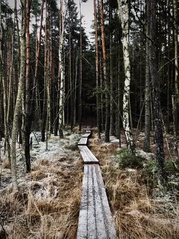
</a>
<a href="photos/gothenburg/got_12.webp">
  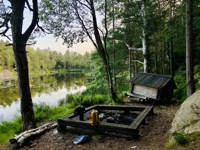
</a>

<a href="photos/gothenburg/got_22.webp">
  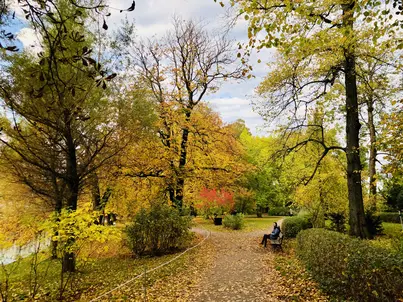
</a>

  <a href="photos/gothenburg/got_29.webp">
  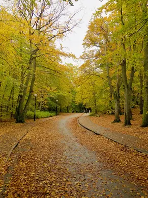
</a>
  

<h1> Copenhagen</h1> 

  
  
  <a href="photos/copenhagen/cph_3.webp">
  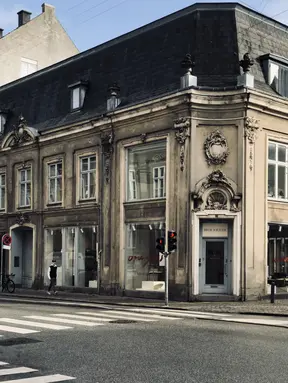
</a>

<a href="photos/copenhagen/cph_5.webp">
  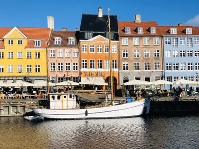
</a>

<a href="photos/copenhagen/cph_9.webp">
  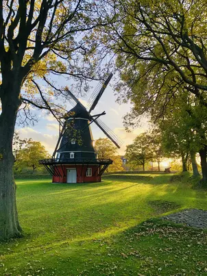
</a>
<a href="photos/copenhagen/cph_10.webp">
  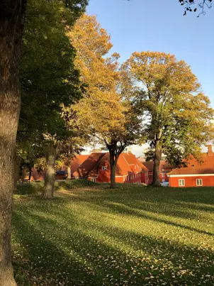
</a>
<a href="photos/copenhagen/cph_11.webp">
  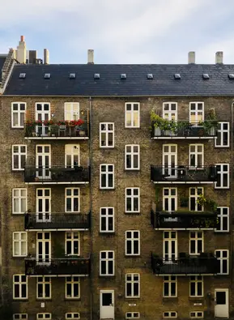
</a>

<a href="photos/copenhagen/cph_13.webp">
  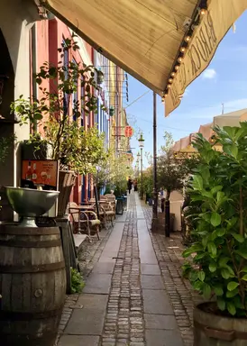
</a>

<a href="photos/copenhagen/cph_15.webp">
  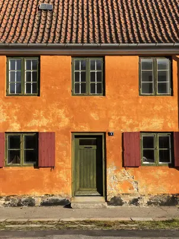
</a>
  
  
  
 
  <!-- More images -->

<h1> Room 1514 </h1> 
Here are some photos that I have taken in and from my room in Gothenburg, Sweden, over the time. I have had some of my worst and - I wouldn't say best - but the most meaningful and loving times of my life in this house. Naturally, I have grown to be very fond and attached to it and perhaps this is my humble way to capture it, to keep it with me, in the form of photos. I will forever be grateful to universe for this house, this room - Room 1514.

  

  
  
  </body>
