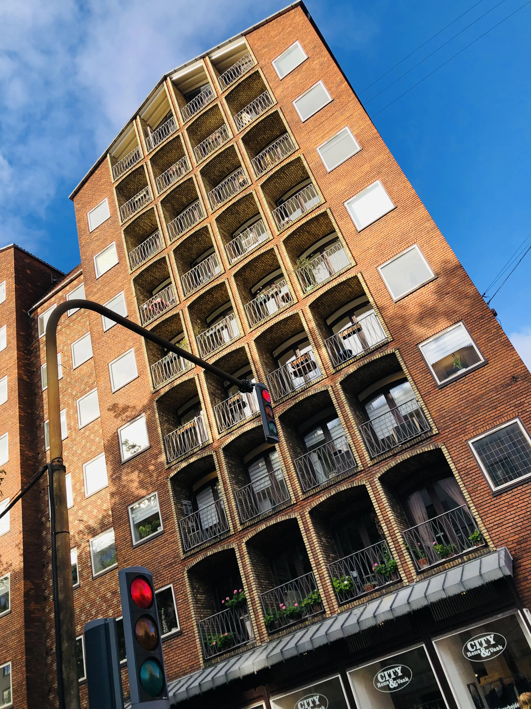
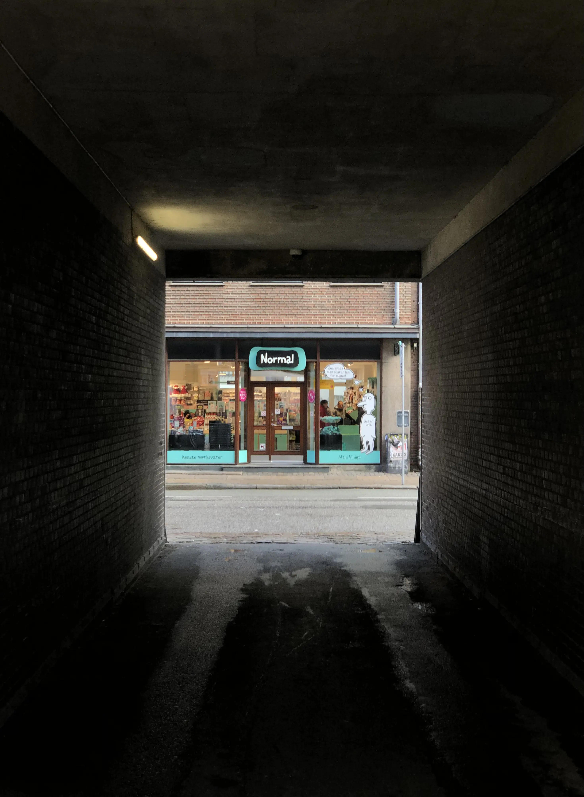
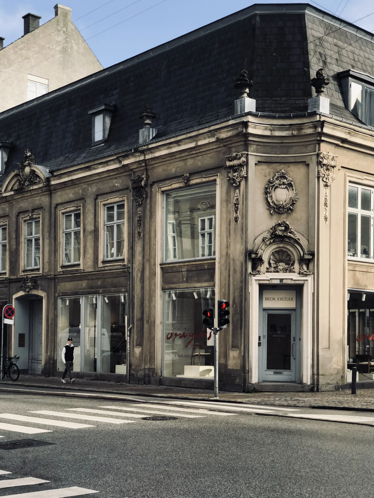
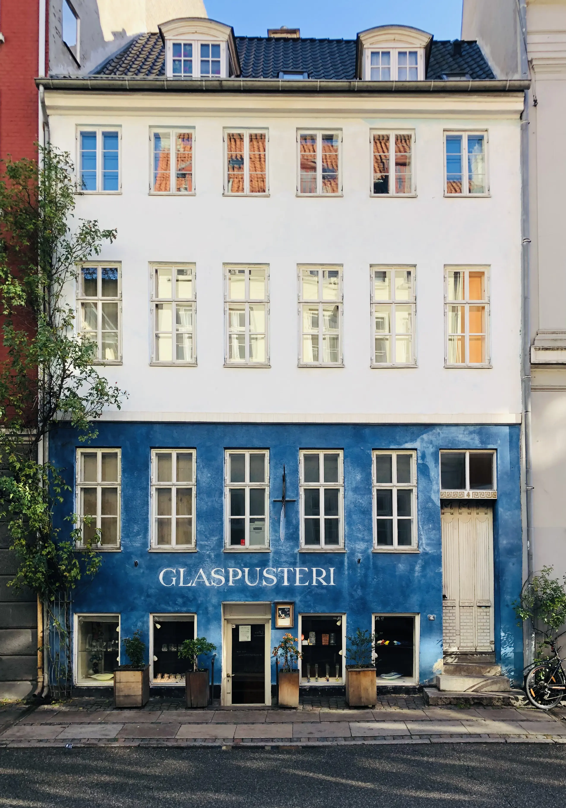
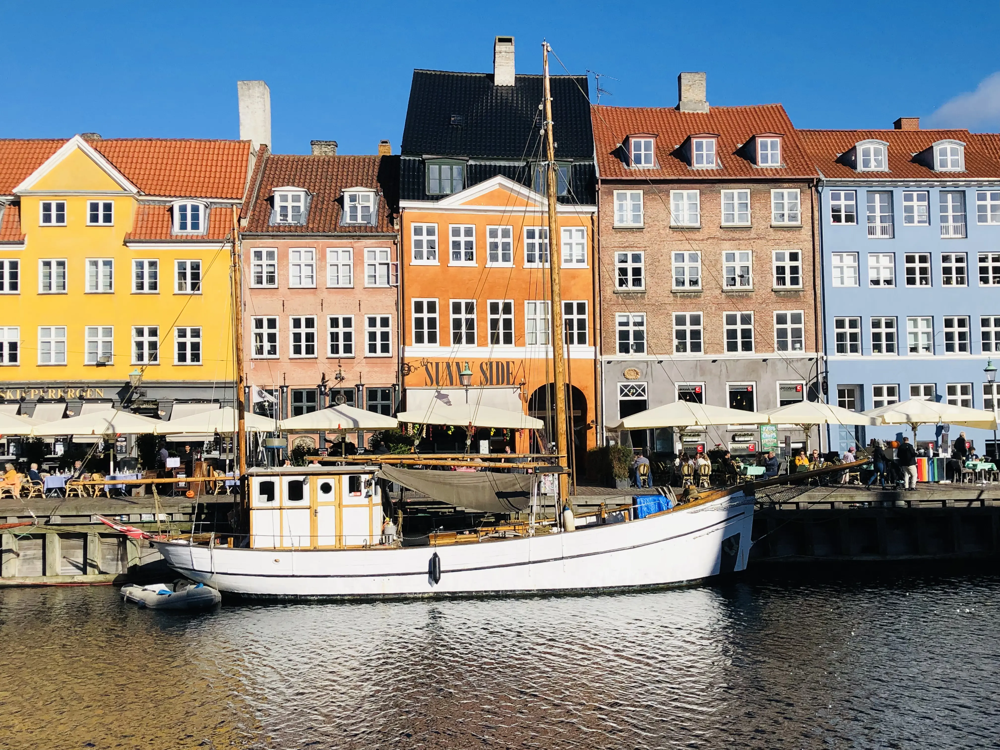
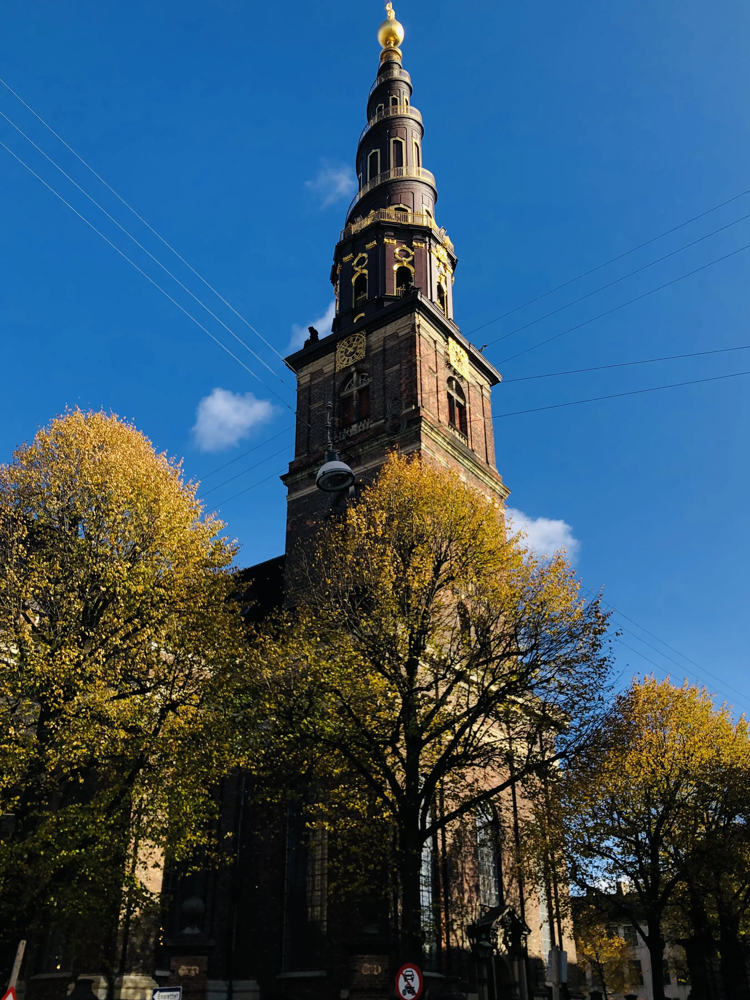
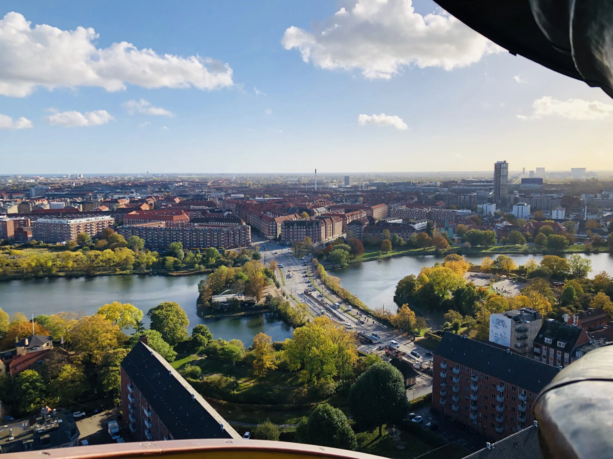
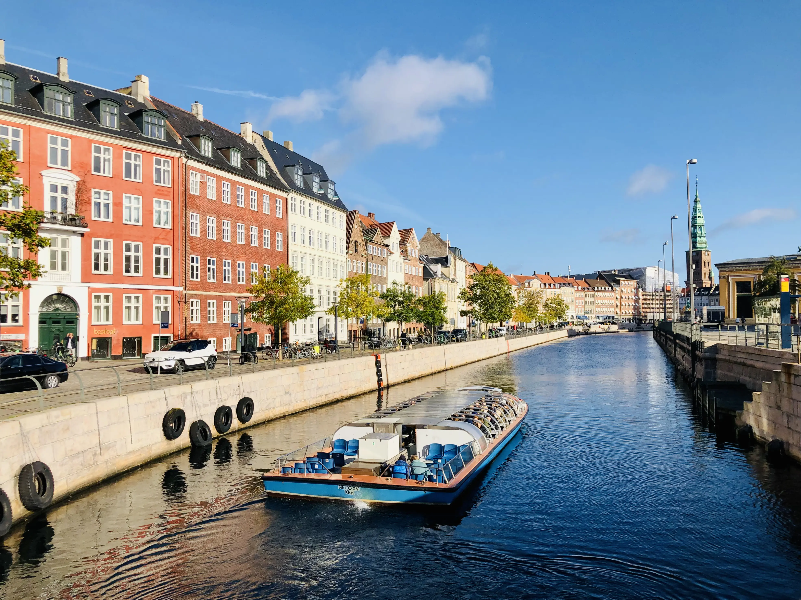
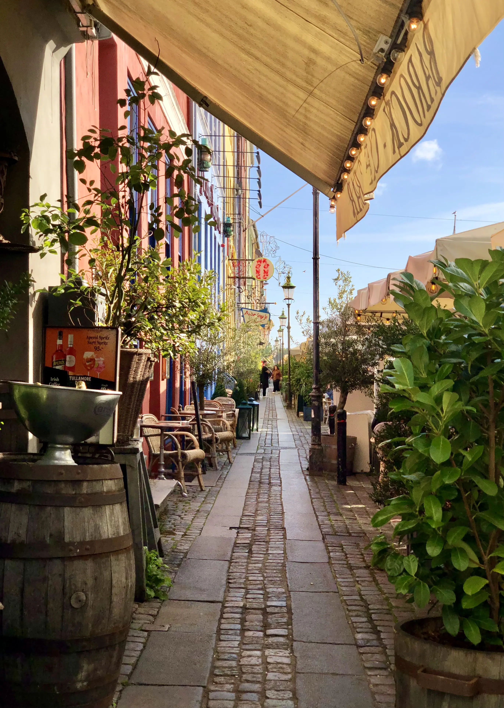
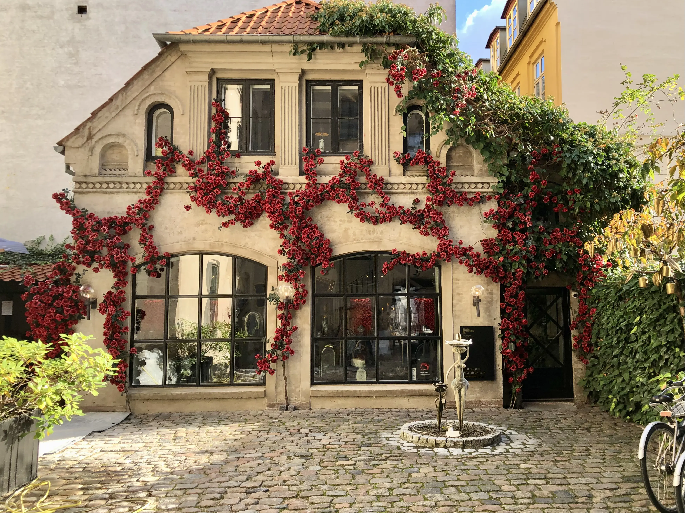

#Photos
Here are a bunch of photos I have taken.

<html lang="en">
<head>
  <meta charset="UTF-8">
  <meta name="viewport" content="width=device-width, initial-scale=1.0">
  <title>Image Gallery</title>
  
</head>
<body>
  <!-- Your Image Gallery -->

<a href="photos/copenhagen/cph_16.webp">
  

  <!-- JavaScript -->
  
  
</body>
</html>
