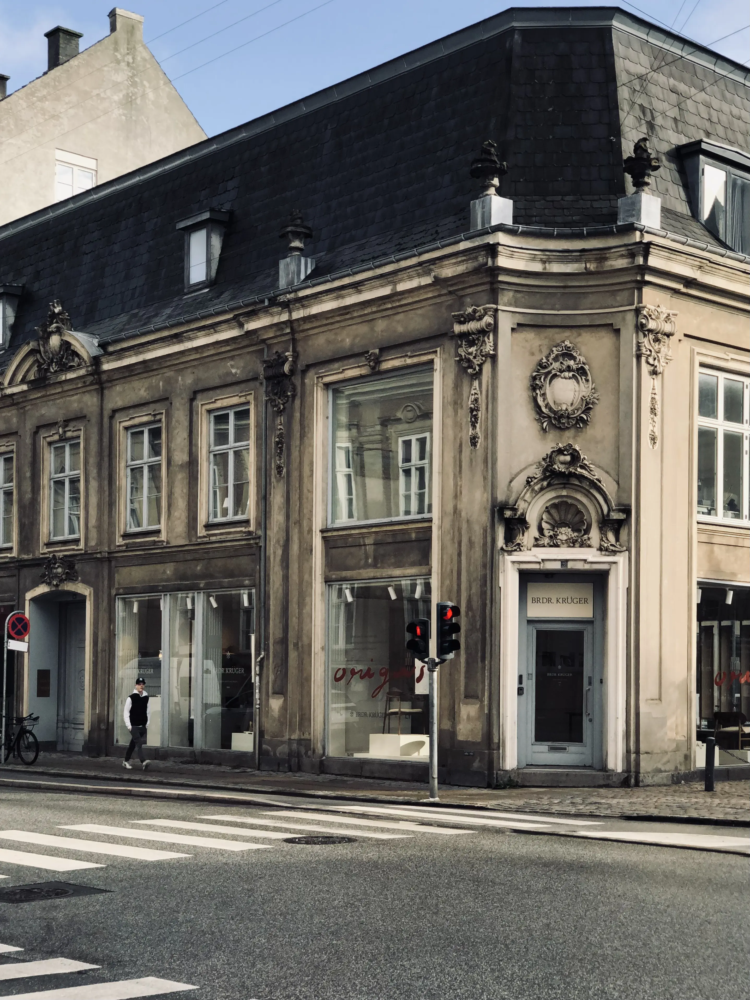

# My Photo Gallery

Welcome to my photo gallery! Click on any image to see the full size.

<head>
  <meta charset="UTF-8">
  <meta name="viewport" content="width=device-width, initial-scale=1.0">
  <title>Image Gallery</title>
  <link rel="stylesheet" href="https://cdnjs.cloudflare.com/ajax/libs/lightgallery/2.7.1/css/lightgallery.min.css">
  
</head>
<body>
  <h1>My Photo Gallery</h1>
  

    
    
    
    <!-- Add more images -->
  

   ## Copenhagen
  

    
    
    <!-- Add more images -->
  

  
  
  
  
</body>
